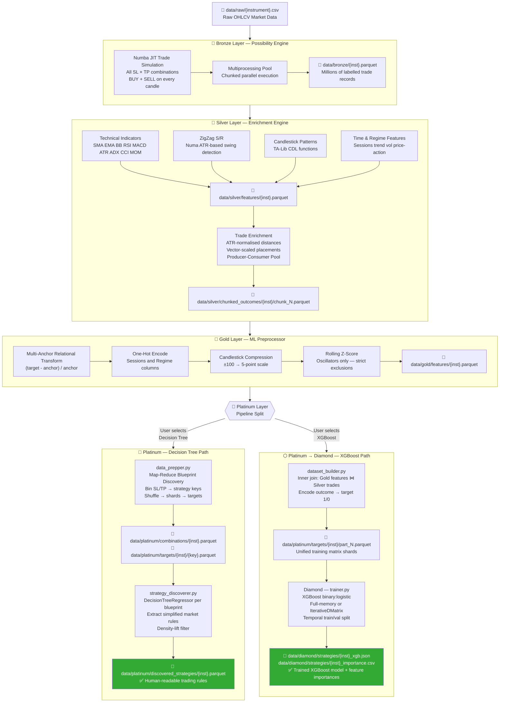
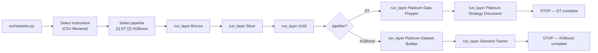

# Full System Architecture

**File:** `docs/FULL_ARCHITECTURE.md`

---

## 1. System Overview

The **Quant Strategy Discovery** system is an end-to-end ML pipeline that automatically discovers profitable trading strategies from raw OHLCV market data. It operates as a layered data processing system, where each layer progressively transforms raw market data into either human-readable trading rules or a trained XGBoost model.

The pipeline answers the core question: _"Given the state of the market at a specific candle, what Stop Loss / Take Profit configuration has a statistically proven edge?"_

### ML Lifecycle Summary

| Stage               | Layer    | What it does                                                            |
| ------------------- | -------- | ----------------------------------------------------------------------- |
| Raw simulation      | Bronze   | Exhaustively simulate millions of trades across all SL/TP ratios        |
| Feature engineering | Silver   | Enrich each trade with 300+ market context features                     |
| Normalisation       | Gold     | Convert absolute prices to relative values; standardise signals         |
| Strategy extraction | Platinum | Mine rules (Decision Tree path) or build training matrix (XGBoost path) |
| Model training      | Diamond  | Train XGBoost on the full joined dataset                                |

---

## 2. Complete Data Pipeline Diagram



---

## 3. Orchestrator Flow

The `orchestrator.py` is the single entry point. It:

1. Lists all CSV files in `data/raw/`
2. Prompts the user to select one instrument
3. Prompts for pipeline type: **Decision Tree** or **XGBoost**
4. Runs all stages sequentially via subprocess, passing the instrument name as `sys.argv[1]`



If any stage returns a non-zero exit code the pipeline halts immediately. Each stage is called with the `-u` flag (unbuffered stdout) so tqdm progress bars render correctly.

---

## 4. Global Configurations (`config/config.py`)

All pipeline-wide settings are centralised in `config/config.py`. Layer scripts import it as `import config.config as c`.

### Key Configuration Sections

| Section      | Key Constants                                                                                                                | Purpose                             |
| ------------ | ---------------------------------------------------------------------------------------------------------------------------- | ----------------------------------- |
| **Global**   | `MAX_CPU_USAGE`, `CONSOLE_LOG_LEVEL`, `FILE_LOG_LEVEL`                                                                       | System-wide parallelism and logging |
| **Bronze**   | `TIMEFRAME_PRESETS`, `BRONZE_GENERATION_MODE`, `SIMULATION_SPREAD_PIPS`, `PIP_SIZE_MAP`                                      | Trade simulation grid               |
| **Silver**   | `SILVER_INDICATOR_WARMUP_PERIOD`, `SMA_PERIODS`, `EMA_PERIODS`, `ATR_PERIODS`, `SESSION_BINS/LABELS`, `SWING_ATR_MULTIPLIER` | Feature engineering parameters      |
| **Gold**     | `GOLD_NORMALIZATION_CONFIG`, `GOLD_SCALER_ROLLING_WINDOW`                                                                    | Normalisation rules                 |
| **Platinum** | `PLATINUM_BPS_BIN_SIZE`, `PLATINUM_DT_MAX_DEPTH`, `PLATINUM_MIN_CANDLES_PER_RULE`, `PLATINUM_DENSITY_LIFT_THRESHOLD`         | Strategy discovery thresholds       |
| **Diamond**  | `DIAMOND_XGB_PARAMS`, `DIAMOND_BOOST_ROUNDS`, `DIAMOND_EARLY_STOPPING`, `DIAMOND_LOAD_FULL_DATASET_IN_MEMORY`                | XGBoost training hyperparameters    |

### `TIMEFRAME_PRESETS` (Bronze simulation grid)

```python
TIMEFRAME_PRESETS = {
    "1m":  { "SL_RATIOS": arange(0.0005, 0.0105, 0.0005),
             "TP_RATIOS": arange(0.0005, 0.0205, 0.0005),
             "MAX_LOOKFORWARD": 200 },
    "5m":  { ... },
    ...
    "60m": { "SL_RATIOS": arange(0.005, 0.0505, 0.001),
             "TP_RATIOS": arange(0.005, 0.1005, 0.001),
             "MAX_LOOKFORWARD": 600 },
}
```

### `GOLD_NORMALIZATION_CONFIG` (Relational transform rules)

An ordered list of `{anchor_col, targets_regex}` dicts. Each rule normalises all columns matching the regex relative to the anchor. The order matters because anchor columns are dropped after use.

---

## 5. Utility Modules (`src/utils/`)

| Module               | Key Functions                                                                | Purpose                                                                                                         |
| -------------------- | ---------------------------------------------------------------------------- | --------------------------------------------------------------------------------------------------------------- |
| `paths.py`           | `ensure_directories()`                                                       | Defines `Path` objects for every data directory; called at layer startup to guarantee the directory tree exists |
| `logger.py`          | `setup_logging(log_dir, console_level, file_level, script_name)`             | Configures root logger with rotating file handler (5 MB × 5 backups) and console handler                        |
| `file_selector.py`   | `scan_new_files(input_dir, output_dir)`, `select_files_interactively(files)` | Utility for detecting unprocessed files and prompting user selection in standalone mode                         |
| `raw_data_loader.py` | `load_and_clean_raw_ohlc_csv(file_path)`                                     | Reads raw CSV, assigns column names from config, coerces types, strips timezone, drops invalid rows             |

### Directory Structure (`paths.py`)

```
data/
├── raw/                          ← Input: raw OHLCV CSVs
├── bronze/                       ← Bronze Layer output
├── silver/
│   ├── features/                 ← Silver features per instrument
│   └── chunked_outcomes/         ← Enriched trade chunks per instrument
├── gold/
│   └── features/                 ← Gold ML-ready features
├── platinum/
│   ├── combinations/             ← Blueprint catalogues
│   ├── targets/                  ← DT: per-key density files │   │                                 XGBoost: training matrix shards
│   ├── temp_targets/             ← Shuffle phase temp files
│   ├── discovered_strategies/    ← DT output: human-readable rules
│   ├── blacklists/               ← Feedback blacklist
│   └── discovery_log/            ← Incremental processing log
└── diamond/
    ├── strategies/               ← XGBoost models + feature importances
    ├── triggers/                 ← Threshold configs (reserved)
    ├── trade_logs/               ← Backtest logs (reserved)
    ├── reports/                  ← Reports (reserved)
    └── validation/               ← Validation artefacts (reserved)
logs/                             ← Rotating log files per layer
```

---

## 6. Cross-Cutting Concerns

### Error Handling

- Every layer script calls `sys.exit(1)` on fatal import/config errors
- The orchestrator checks the subprocess return code after every stage; a non-zero code halts the pipeline immediately
- Workers in multiprocessing pools return structured error dicts (`{'status': 'error', 'traceback': ...}`); fatal worker errors terminate the pool

### Logging

- All layers use the same `setup_logging` utility producing timestamped lines in `logs/{layer_name}.log`
- Console level controlled by `CONSOLE_LOG_LEVEL` (default `INFO`); file level by `FILE_LOG_LEVEL` (default `DEBUG`)

### Memory Management

- Bronze, Silver, and Platinum (Data Prepper) all use explicit buffer flushing to Parquet to keep peak RAM bounded
- Gold runs single-threaded on one instrument at a time; memory is bounded by the Silver features file size
- Diamond's iterative mode streams shards via `QuantileDMatrix` for low-RAM machines

### Incremental Processing

- All layer scripts check for existing output before reprocessing — Bronze skips if the parquet exists, Silver/Gold check `scan_new_files`, Platinum Strategy Discoverer logs processed keys to a `.processed.log` file
- The orchestrator does **not** enforce idempotency — re-running stages will overwrite existing output

---

## 7. Architectural Decision Record

### Why a layered data pipeline?

Each transformation stage has markedly different compute and memory profiles (CPU-bound simulation, I/O-bound enrichment, in-memory normalisation). Separating them into independent scripts allows each to be developed, tested, and rerun in isolation, and allows intermediate outputs to be inspected.

### Why two Platinum paths?

The Decision Tree path is designed for **interpretability**: it produces explicit `if RSI > X and EMA_rel_close < Y → trade this setup` rules that can be understood and validated by a human trader. The XGBoost path sacrifices interpretability for **predictive power**: the model can capture non-linear interactions across 300+ features simultaneously. Having both paths means the system can serve both research and production goals.

### Why Numba for simulation and ZigZag?

Bronze simulation iterates over hundreds of millions of `(candle, SL, TP)` combinations. Python loops at this scale would take hours. Numba JIT compilation brings the inner loop to near-C performance with no change to the algorithm logic.

### Why TA-Lib alongside `ta` library?

The `ta` library provides a clean, pandas-native API for standard indicators. TA-Lib is retained exclusively for its comprehensive candlestick pattern recognition (`get_function_groups()["Pattern Recognition"]`) which has no equivalent in `ta`.
