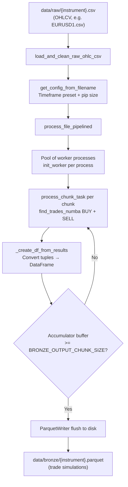
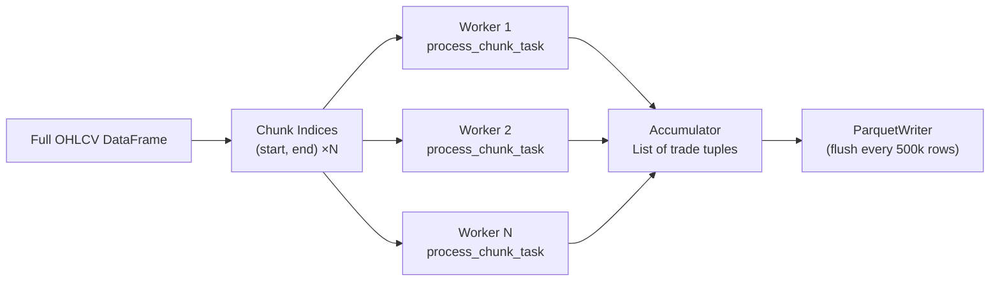

# Bronze Layer Architecture

**File:** `docs/bronze_architecture.md`  
**Source script:** `src/layers/bronze/generator.py`

---

## Overview

The Bronze Layer is the **Possibility Engine** — the first and most computationally expensive stage of the pipeline. It exhaustively simulates every possible BUY and SELL trade on every candle across a configurable grid of Stop Loss (SL) and Take Profit (TP) ratios, and records the outcome of each trade. The result is a massive Parquet dataset of raw, labelled trade outcomes that all downstream layers depend on.

---

## Data Flow

---

## Inputs

| Source                      | Format          | Key Columns                            |
| --------------------------- | --------------- | -------------------------------------- |
| `data/raw/{instrument}.csv` | CSV (no header) | `time, open, high, low, close, volume` |

The raw CSV is loaded via `src/utils/raw_data_loader.load_and_clean_raw_ohlc_csv()`, which assigns column names from `config.RAW_DATA_COLUMNS`, coerces types, strips timezone info, and drops rows with missing values.

---

## Core Logic: Trade Simulation

### `find_trades_numba` (Numba JIT)

The central simulation function is compiled to native machine code via `@njit`. For every candle _i_ in the dataset it loops over every `(SL ratio, TP ratio)` combination for both BUY and SELL directions.

**Strict SL Priority rule**: For each future candle `j`:

1. If `low[j] ≤ sl_price` → **Loss** (SL hit). Break.
2. Else if `high[j] ≥ tp_price + spread_cost` → **Win** (TP hit). Break.

The spread is baked into the TP check, making win conditions slightly harder to reach.

### Generation Modes (`BRONZE_GENERATION_MODE`)

| Mode        | Behaviour                                                |
| ----------- | -------------------------------------------------------- |
| `WINS_ONLY` | Only winning trades are saved. Fastest, smallest output. |
| `BALANCED`  | Losses sampled 1-for-1 to match win count per chunk.     |
| `ALL`       | Every trade (win + loss) is retained. Largest output.    |

---

## Parallelism

The dataset is split into chunks of `BRONZE_INPUT_CHUNK_SIZE` rows. Each chunk is dispatched to a worker from a `multiprocessing.Pool` (size = `MAX_CPU_USAGE`). Workers share a read-only copy of the DataFrame and configuration via an initializer function (`init_worker`), avoiding repeated serialisation.

---

## Configuration Dependencies (`config/config.py`)

| Config Key                     | Purpose                                                                            |
| ------------------------------ | ---------------------------------------------------------------------------------- |
| `TIMEFRAME_PRESETS`            | Maps timeframe string (e.g. `"1m"`) to `SL_RATIOS`, `TP_RATIOS`, `MAX_LOOKFORWARD` |
| `BRONZE_INPUT_CHUNK_SIZE`      | Rows per simulation chunk (default 5 000)                                          |
| `BRONZE_OUTPUT_CHUNK_SIZE`     | Row accumulator flush threshold (default 500 000)                                  |
| `BRONZE_GENERATION_MODE`       | `WINS_ONLY` / `BALANCED` / `ALL`                                                   |
| `BRONZE_MAX_SAMPLES_PER_CHUNK` | Hard cap per chunk (currently not enforced as a hard clip in V20.1)                |
| `SIMULATION_SPREAD_PIPS`       | Per-instrument spread in pips                                                      |
| `PIP_SIZE_MAP`                 | Per-instrument pip decimal value                                                   |
| `MAX_CPU_USAGE`                | Pool worker count                                                                  |
| `RAW_DATA_COLUMNS`             | Column names for raw CSV                                                           |

---

## Outputs

| Path                               | Format                             | Schema    |
| ---------------------------------- | ---------------------------------- | --------- |
| `data/bronze/{instrument}.parquet` | Parquet (PyArrow writer, streamed) | See below |

### Output Schema

| Column        | Type                    | Description                             |
| ------------- | ----------------------- | --------------------------------------- |
| `entry_time`  | datetime64[ns]          | Candle timestamp when trade was entered |
| `trade_type`  | category (`buy`/`sell`) | Trade direction                         |
| `entry_price` | float32                 | Close price at entry                    |
| `sl_price`    | float32                 | Absolute Stop Loss price                |
| `tp_price`    | float32                 | Absolute Take Profit price              |
| `sl_ratio`    | float32                 | SL expressed as fraction of entry price |
| `tp_ratio`    | float32                 | TP expressed as fraction of entry price |
| `exit_time`   | datetime64[ns]          | Candle timestamp when trade resolved    |
| `outcome`     | category (`win`/`loss`) | Whether TP or SL was hit first          |

---

## Key Implementation Notes

- **Numba warmup**: `find_trades_numba` is invoked once with dummy data at startup to trigger JIT compilation before the main processing loop.
- **Memory management**: Results accumulate in a Python list; if the list exceeds `BRONZE_OUTPUT_CHUNK_SIZE` it is flushed to the output Parquet file and cleared.
- **Overwrite semantics**: If the output file already exists it is deleted before writing begins.
- **File naming**: `EURUSD1.csv` → `EURUSD1.parquet`; the timeframe and instrument are parsed from the filename with a regex.
