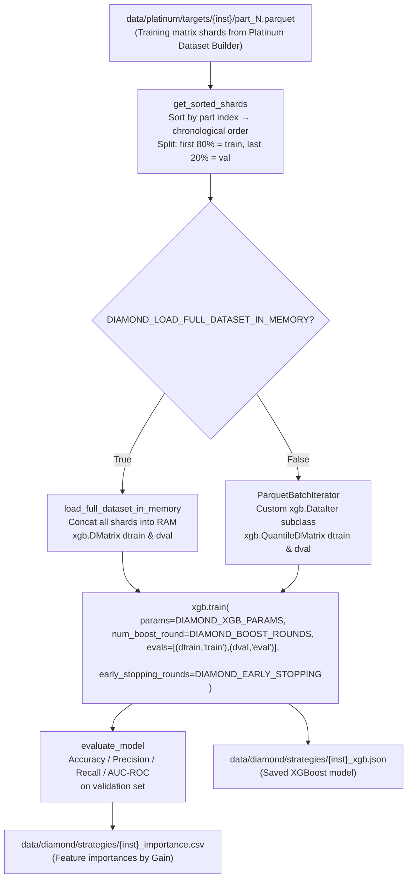
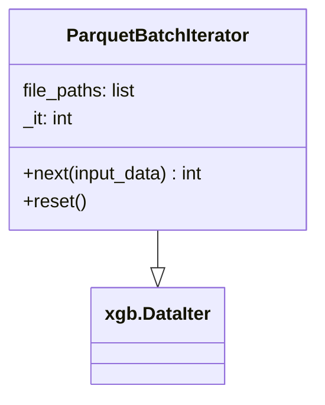

# Diamond Layer Architecture

**File:** `docs/diamond_architecture.md`  
**Source script:** `src/layers/diamond/trainer.py`

---

## Overview

The Diamond Layer is the **Model Trainer** — the final stage of the XGBoost pipeline path. It consumes the sharded training matrix produced by the Platinum Dataset Builder and trains a binary classification XGBoost model to predict whether a given trade setup (parametrised by market context + SL/TP placement) will be a win or a loss.

The layer supports two RAM modes:

- **Full Memory Mode** (server/GPU): loads all shards into RAM simultaneously for maximum training speed
- **Iterative Mode** (laptop/8 GB RAM): streams shards one at a time via `xgb.QuantileDMatrix`

---

## Data Flow



---

## Inputs

| Source                                        | Format         | Notes                                                |
| --------------------------------------------- | -------------- | ---------------------------------------------------- |
| `data/platinum/targets/{inst}/part_N.parquet` | Parquet shards | Must contain a `target` column (int8: 1=win, 0=loss) |

### Expected Shard Schema

| Column                   | Type    | Role                     |
| ------------------------ | ------- | ------------------------ |
| `target`                 | int8    | Label: 1=win, 0=loss     |
| `sl_ratio`, `tp_ratio`   | float32 | Trade parameters         |
| `sl_dist_to_{level}_atr` | float32 | SL-level ATR distances   |
| `tp_dist_to_{level}_atr` | float32 | TP-level ATR distances   |
| `sl_place_scale_{level}` | float32 | Vector-scaled placements |
| All Gold feature columns | float32 | Market context at entry  |

Columns `entry_time` and `exit_time` are dropped inside both loading paths if present.

---

## Train / Validation Split

The shards are sorted numerically (`part_0 → part_N`) which preserves chronological order because the Platinum Dataset Builder creates them in Silver chunk order. The split index is:

```python
split_idx = int(len(sorted_files) * (1 - DIAMOND_TEST_SIZE))
# clamped to len - 1 to ensure at least one validation file
```

This is a **temporal split** — the model is never evaluated on data that precedes its training data, which correctly mirrors live deployment conditions.

---

## Training Paths

### Full Memory Mode (`DIAMOND_LOAD_FULL_DATASET_IN_MEMORY = True`)

1. All train + validation shards are loaded via `pd.read_parquet` and concatenated
2. `xgb.DMatrix` objects are built from the full numpy arrays in memory
3. GPU training is possible by setting `device: 'cuda'` in `DIAMOND_XGB_PARAMS`

### Iterative Mode (`DIAMOND_LOAD_FULL_DATASET_IN_MEMORY = False`)



`ParquetBatchIterator` subclasses `xgb.DataIter`:

- `next(input_data)`: reads the current shard, separates `X` and `y`, calls `input_data(data=X, label=y)`, advances the iterator
- `reset()`: resets `_it = 0` so XGBoost can make multiple passes

`xgb.QuantileDMatrix(train_iter)` builds approximate histograms without loading all data at once, enabling XGBoost's `hist` tree method on machines with limited RAM.

---

## XGBoost Parameters

| Parameter          | Value             | Notes                                                                    |
| ------------------ | ----------------- | ------------------------------------------------------------------------ |
| `objective`        | `binary:logistic` | Outputs a probability in [0,1]                                           |
| `eval_metric`      | `logloss`         | Cross-entropy loss for early stopping                                    |
| `eta`              | 0.05              | Conservative learning rate                                               |
| `max_depth`        | 8                 | Tree depth                                                               |
| `subsample`        | 0.8               | Stochastic row sampling per tree                                         |
| `colsample_bytree` | 0.8               | Feature sampling per tree                                                |
| `tree_method`      | `hist`            | CPU histogram method; change to `gpu_hist` or add `device: cuda` for GPU |
| `nthread`          | `MAX_CPU_USAGE`   | Set at runtime                                                           |

All parameters are defined in `config.DIAMOND_XGB_PARAMS` and can be overridden without touching the trainer code.

---

## Evaluation (`evaluate_model`)

After training, the model is evaluated on the held-out validation set:

| Metric        | Description                                             |
| ------------- | ------------------------------------------------------- |
| **Accuracy**  | Fraction of correctly classified trades (threshold 0.5) |
| **Precision** | Of predicted wins, what fraction actually won           |
| **Recall**    | Of actual wins, what fraction were identified           |
| **AUC-ROC**   | Area under the ROC curve; threshold-independent         |

In Full Memory mode, `dval` is reused directly. In Iterative mode, validation shards are re-loaded batch by batch for inference.

---

## Configuration Dependencies

| Config Key                            | Purpose                                                  |
| ------------------------------------- | -------------------------------------------------------- |
| `DIAMOND_LOAD_FULL_DATASET_IN_MEMORY` | Toggle between full-RAM and iterative loading            |
| `DIAMOND_XGB_PARAMS`                  | Full XGBoost parameter dictionary                        |
| `DIAMOND_BOOST_ROUNDS`                | Maximum number of boosting rounds (default 1 000)        |
| `DIAMOND_EARLY_STOPPING`              | Stop if no improvement for N rounds (default 50)         |
| `DIAMOND_TEST_SIZE`                   | Fraction of shards held out for validation (default 0.2) |
| `MAX_CPU_USAGE`                       | Thread count passed to XGBoost                           |

---

## Outputs

| Path                                            | Format                | Description                                                                            |
| ----------------------------------------------- | --------------------- | -------------------------------------------------------------------------------------- |
| `data/diamond/strategies/{inst}_xgb.json`       | JSON (XGBoost native) | Fully trained XGBoost model; can be loaded with `xgb.Booster.load_model()`             |
| `data/diamond/strategies/{inst}_importance.csv` | CSV                   | Feature importances sorted by `gain`; useful for post-hoc analysis and feature pruning |

---

## Key Implementation Notes

- The Diamond Layer only exists in the **XGBoost pipeline path**. If the Decision Tree path is selected in the orchestrator, this layer is never executed.
- Feature names are preserved in the `DMatrix` objects so that `get_score(importance_type='gain')` returns interpretable column names.
- The output model JSON is self-contained and can be deployed to the MT5 validator or any XGBoost-compatible inference engine independently of this codebase.
