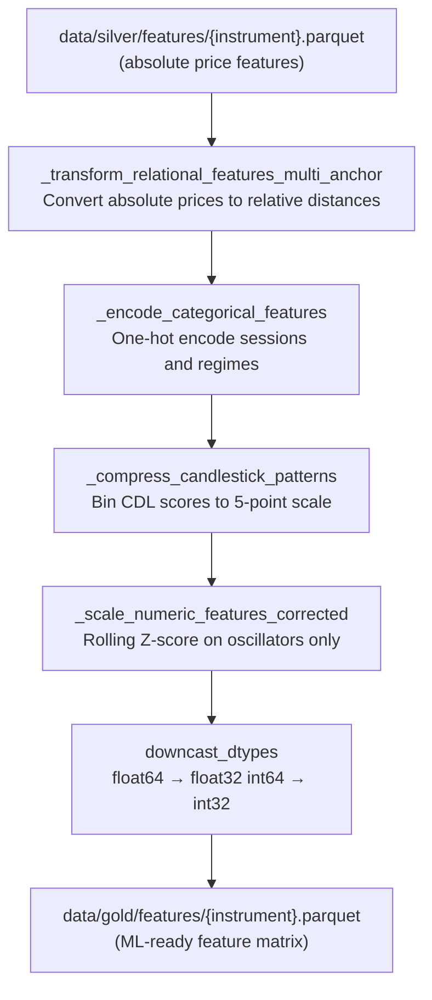

# Gold Layer Architecture

**File:** `docs/gold_architecture.md`  
**Source script:** `src/layers/gold/generator.py`

---

## Overview

The Gold Layer is the **ML Preprocessor**. It consumes the raw technical-indicator features from the Silver Layer and converts them into a fully normalised, ML-ready feature matrix. The pipeline enforces a **strict scaling policy** to prevent signal corruption — it deliberately _avoids_ scaling relational, categorical, and time features that would lose their meaning under standardisation.

---

## Data Flow



---

## Inputs

| Source                                      | Format  | Notes                                                          |
| ------------------------------------------- | ------- | -------------------------------------------------------------- |
| `data/silver/features/{instrument}.parquet` | Parquet | Per-candle market features with absolute prices and indicators |

---

## Transformation Pipeline

### Step 1 — Multi-Anchor Relational Transformation (`_transform_relational_features_multi_anchor`)

All absolute price values are converted to _relative_ values using the formula:

```
new_col = (target - anchor) / anchor
```

This makes every numerical value dimensionless and comparable across instruments and time periods. The transformation rules are defined in `config.GOLD_NORMALIZATION_CONFIG`:

| Rule                      | Anchor    | Targets                                          | Output Example                              |
| ------------------------- | --------- | ------------------------------------------------ | ------------------------------------------- |
| 1. Indicator vs Close     | `close`   | SMA, EMA, BB, ATR levels, support, resistance, … | `SMA_20_rel_close`, `BB_upper_20_rel_close` |
| 2. Range vs Open          | `open`    | `high`, `low`                                    | `high_rel_open`, `low_rel_open`             |
| 3. Trend Deviation        | `SMA_200` | `close`                                          | `close_rel_SMA_200`                         |
| 4. Volatility Compression | `SMA_20`  | `BB_upper_20`, `BB_lower_20`                     | `BB_upper_20_rel_SMA_20`                    |

After transformation, all original absolute price columns and anchor columns are **dropped**. The `volume` column is also dropped at this stage.

### Step 2 — Categorical Encoding (`_encode_categorical_features`)

String-valued columns (`session`, `trend_regime_*`, `vol_regime_*`) are one-hot encoded using `pd.get_dummies` with `drop_first=False`. The list of original categorical columns is retained for use in Step 4 to prevent them being accidentally scaled.

### Step 3 — Candlestick Pattern Compression (`_compress_candlestick_patterns`)

TA-Lib CDL columns contain integer scores (typically ±100 for strong signals, ±50 for weak). These are binned to a 5-point ordinal scale:

| Input Value    | Output                |
| -------------- | --------------------- |
| ≥ 100          | 1.0 (Strong Bullish)  |
| > 0 and < 100  | 0.5 (Weak Bullish)    |
| 0              | 0.0 (Neutral)         |
| < 0 and > -100 | -0.5 (Weak Bearish)   |
| ≤ -100         | -1.0 (Strong Bearish) |

NaN values are filled to 0 (Neutral) before compression.

### Step 4 — Rolling Z-Score Normalisation (`_scale_numeric_features_corrected`)

A **strict exclusion policy** determines which columns are scaled:

| Column Type                                   | Scaled? | Reason                                                |
| --------------------------------------------- | ------- | ----------------------------------------------------- |
| `CDL_*` candlestick scores                    | **No**  | Already [-1, 1]; re-scaling destroys ordinal meaning  |
| One-hot encoded columns                       | **No**  | Binary 0/1; Z-score would produce nonsensical values  |
| `*_rel_*` relational columns                  | **No**  | Percentage distances; sign is semantically meaningful |
| `hour`, `weekday`, `time`                     | **No**  | Cyclical/structural; Z-score breaks the 0-23 cycle    |
| Oscillators, statistics (RSI, CCI, avg_body…) | **Yes** | Rolling Z-score over `GOLD_SCALER_ROLLING_WINDOW`     |

**Rolling Z-score formula:**

```
col_scaled = (col - rolling_mean(window)) / rolling_std(window)
```

NaN values (warmup period + any zeros in std) are back-filled then set to 0, so no NaN propagates into the model.

---

## Configuration Dependencies

| Config Key                   | Purpose                                                              |
| ---------------------------- | -------------------------------------------------------------------- |
| `GOLD_NORMALIZATION_CONFIG`  | List of `{anchor_col, targets_regex}` rules for relational transform |
| `GOLD_SCALER_ROLLING_WINDOW` | Window size for rolling Z-score normalisation                        |
| `MAX_CPU_USAGE`              | (Not used here; Gold runs single-threaded per file)                  |

---

## Outputs

| Path                                      | Format  | Notes                                                                                          |
| ----------------------------------------- | ------- | ---------------------------------------------------------------------------------------------- |
| `data/gold/features/{instrument}.parquet` | Parquet | ML-ready feature matrix; consumed by Platinum Strategy Discoverer and Platinum Dataset Builder |

### Output Schema Characteristics

- **No absolute price columns** — all dropped after relational transform
- **No categorical string columns** — one-hot encoded
- **Candlestick columns** — compressed to 5-point scale
- **Oscillator/stat columns** — rolling Z-scored
- **Relational `_rel_` columns** — percentage distances; untouched by scaler
- **Time columns** (`hour`, `weekday`) — raw integers; untouched by scaler
- All numeric columns downcast to `float32` / `int32` for memory efficiency

---

## Key Design Principle: Strict Scaling

The Gold Layer's most important property is what it deliberately **does not** scale. Scaling relational features (e.g. `close_rel_SMA_200 = +0.03`, meaning "2% above the 200-SMA") would flip signs relative to local history, destroying the critical "above/below" signal. The strict policy ensures each feature type retains its intended semantics for the downstream ML models.
