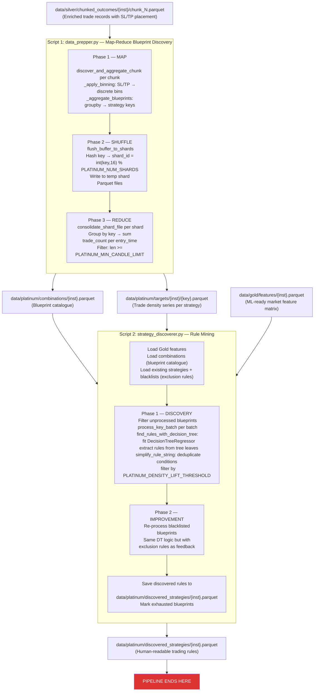
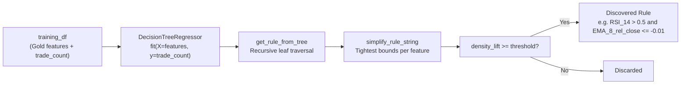

# Platinum Layer Architecture — Decision Tree Path

**File:** `docs/platinum_decision_tree_arch.md`  
**Source scripts:** `src/layers/platinum/data_prepper.py` → `src/layers/platinum/strategy_discoverer.py`

---

## Overview

The Decision Tree path of the Platinum Layer is the **Rule Mining Engine**. It takes the millions of enriched trade records from the Silver Layer and uses a two-script pipeline to discover explicit, human-readable trading rules:

1. **Data Prepper** (`data_prepper.py`) — A distributed Map-Reduce job that indexes all Silver trade data into per-strategy "target" files, where each file contains the time-series of trade density for one unique strategy configuration.
2. **Strategy Discoverer** (`strategy_discoverer.py`) — Uses `DecisionTreeRegressor` to mine the Gold features dataset against each strategy's density signal, extracting interpretable market condition rules.

> **This is a terminal path.** The pipeline ends completely at the Platinum layer. No further downstream processing is performed.

---

## Full Decision Tree Pipeline Flow



---

## Script 1: Data Prepper (`data_prepper.py`)

### Strategy Key Generation

A strategy "blueprint" is a tuple uniquely identifying one combination of:

- **Strategy type**: how the anchor (SL or TP) is specified — percentage placement (`SL-Pct`, `TP-Pct`) or basis-points distance (`SL-BPS`, `TP-BPS`)
- **Level**: the market level the anchor is relative to (e.g. `SMA_20`, `resistance`, `EMA_50`)
- **Anchor bin**: the discretised placement value
- **Counterpart**: a fixed ratio for the other side (TP ratio or SL ratio)
- **Trade direction**: `buy` or `sell`

Each blueprint tuple is hashed (SHA-256, first 16 chars) to a short key string for filesystem storage.

### Phase 1 — Binning & Aggregation (`_apply_binning`, `_aggregate_blueprints`)

For each Silver chunk:

- **Percentage placement binning**: `floor(pct_col × 10)` — bins in 10% steps
- **BPS distance binning**: `floor(bps_col / PLATINUM_BPS_BIN_SIZE) × PLATINUM_BPS_BIN_SIZE`

The 4 strategy types are aggregated via `groupby` on `(bin, counterpart_ratio, trade_type, entry_time)`.

### Phase 2 — Shuffle (`flush_buffer_to_shards`)

Results are held in a master buffer. When it exceeds `PLATINUM_BUFFER_FLUSH_THRESHOLD`, records are sharded:

```
shard_id = int(key_hex, 16) % PLATINUM_NUM_SHARDS
```

Each shard is a Parquet file accumulating `(key, entry_time, trade_count)` rows.

### Phase 3 — Reduce (`consolidate_shard_file`)

Each shard file is read and grouped by `key`. For every key:

- Sum `trade_count` per `entry_time` → a time-series of trade density
- If `len(series) >= PLATINUM_MIN_CANDLE_LIMIT` → save as `data/platinum/targets/{inst}/{key}.parquet`
- Keys that don't meet the threshold are discarded

The `combinations` Parquet file listing all valid blueprint keys and their candle counts is written at the end of Phase 3.

---

## Script 2: Strategy Discoverer (`strategy_discoverer.py`)

### Core ML Loop (`find_rules_with_decision_tree`)

For each blueprint key:

1. Load `data/platinum/targets/{inst}/{key}.parquet` → time-series of `trade_count`
2. Inner-join with Gold features on `time` → `training_df` with shape `(n_candles × n_features + 1)`
3. Apply **exclusion feedback**: zero out candles where known bad rules apply
4. Train `DecisionTreeRegressor(max_depth=PLATINUM_DT_MAX_DEPTH, min_samples_leaf=PLATINUM_MIN_CANDLES_PER_RULE)`
5. Traverse the tree to extract all leaf paths → raw rule strings
6. Apply `simplify_rule_string` to eliminate redundant conditions (e.g. `A <= 5 and A <= 3` → `A <= 3`)
7. Accept rules where `leaf.avg_density >= baseline.avg_density × PLATINUM_DENSITY_LIFT_THRESHOLD`



### Discovery vs Improvement Phases

| Phase       | Input blueprints                               | Exclusion rules                  |
| ----------- | ---------------------------------------------- | -------------------------------- |
| Discovery   | Unprocessed (not in strategies/exhausted logs) | Existing strategies + blacklists |
| Improvement | Blacklisted blueprints                         | Same                             |

Both phases use `execute_parallel_processing` with `Pool` + `imap_unordered`, batching blueprints by `PLATINUM_DISCOVERY_BATCH_SIZE`.

### Output Schema (`discovered_strategies/{inst}.parquet`)

| Column        | Type    | Description                                      |
| ------------- | ------- | ------------------------------------------------ |
| `key`         | string  | Blueprint hash identifier                        |
| `market_rule` | string  | Simplified boolean rule expression               |
| `n_candles`   | int64   | Number of historical candles the rule applies to |
| `avg_density` | float64 | Average trade density in those candles           |

---

## Configuration Dependencies

| Config Key                        | Script              | Purpose                                                    |
| --------------------------------- | ------------------- | ---------------------------------------------------------- |
| `PLATINUM_BPS_BIN_SIZE`           | data_prepper        | Basis-point bin width (default 5.0)                        |
| `PLATINUM_BUFFER_FLUSH_THRESHOLD` | data_prepper        | Memory flush threshold (default 2M rows)                   |
| `PLATINUM_NUM_SHARDS`             | data_prepper        | Number of shuffle shard files (default 128)                |
| `PLATINUM_TEMP_SHARD_PREFIX`      | data_prepper        | Temp file prefix                                           |
| `PLATINUM_MIN_CANDLE_LIMIT`       | both                | Min candles for a blueprint to be considered (default 100) |
| `PLATINUM_DT_MAX_DEPTH`           | strategy_discoverer | Decision Tree max depth (default 7)                        |
| `PLATINUM_MIN_CANDLES_PER_RULE`   | strategy_discoverer | `min_samples_leaf` (default 50)                            |
| `PLATINUM_DENSITY_LIFT_THRESHOLD` | strategy_discoverer | Minimum density multiplier over baseline (default 1.5)     |
| `PLATINUM_DISCOVERY_BATCH_SIZE`   | strategy_discoverer | Blueprints per worker batch (default 20)                   |
| `MAX_CPU_USAGE`                   | both                | Multiprocessing pool size                                  |

---

## Terminal Outputs

| Path                                                 | Description                                         |
| ---------------------------------------------------- | --------------------------------------------------- |
| `data/platinum/combinations/{inst}.parquet`          | Blueprint catalogue: all valid keys + candle counts |
| `data/platinum/targets/{inst}/{key}.parquet`         | Per-key trade density time series                   |
| `data/platinum/discovered_strategies/{inst}.parquet` | Final human-readable trading rules                  |
| `data/platinum/blacklists/{inst}.parquet`            | Rules marked for feedback/improvement               |
| `data/platinum/exhausted/{inst}.parquet`             | Exhausted blueprint keys                            |
| `data/platinum/discovery_log/{inst}.processed.log`   | Processed key log for incremental runs              |

> The discovery process is **incremental** — re-running the Strategy Discoverer on the same instrument will skip already-processed blueprints and only attempt to improve blacklisted ones.
