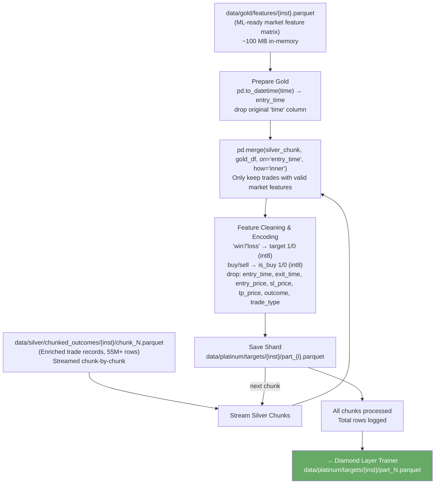

# Platinum Layer Architecture — XGBoost Path

**File:** `docs/platinum_xgboost_arch.md`  
**Source script:** `src/layers/platinum/dataset_builder.py`

---

## Overview

The XGBoost path of the Platinum Layer is the **Dataset Builder**. Rather than extracting discrete rules, it joins the full market context (Gold features) with every individual trade outcome (Silver trades) into a single massive training matrix. This matrix is then consumed directly by the Diamond Layer's XGBoost trainer.

> **This is a transitional path.** The Platinum Dataset Builder does not produce a final artefact on its own — its output flows directly into the Diamond Layer for model training.

---

## Pipeline Flow



---

## Inputs

| Source                                                | Format            | Loading Strategy                                                     |
| ----------------------------------------------------- | ----------------- | -------------------------------------------------------------------- |
| `data/gold/features/{inst}.parquet`                   | Parquet           | Loaded **fully into RAM** once (~100 MB). Used as the join key side. |
| `data/silver/chunked_outcomes/{inst}/chunk_N.parquet` | Parquet (N files) | **Streamed** one file at a time to avoid memory exhaustion           |

---

## Join Logic

The inner join on `entry_time` combines:

- **Left (Silver)**: Individual trade records — trade direction, SL/TP ratios, SL/TP placement distances relative to all market levels, and the binary outcome
- **Right (Gold)**: All normalised market features at that candle — RSI, SMA relationships, Bollinger Band widths, trend/volatility regimes (one-hot), candlestick pattern scores

```
merged = silver_chunk ⋈ gold_df  (on entry_time, inner join)
```

The `inner` join means any trade whose entry candle falls in the Silver warmup period (first `SILVER_INDICATOR_WARMUP_PERIOD` candles where Gold features are NaN) is automatically excluded.

---

## Feature Engineering at Join Time

| Operation               | Input                                                                         | Output                                  |
| ----------------------- | ----------------------------------------------------------------------------- | --------------------------------------- |
| Binary encode outcome   | `outcome` column (`win`/`loss` category)                                      | `target` column (`int8`: 1=win, 0=loss) |
| Binary encode direction | `trade_type` column (`buy`/`sell` category)                                   | `is_buy` column (`int8`: 1=buy, 0=sell) |
| Drop ID columns         | `entry_time, exit_time, entry_price, sl_price, tp_price, outcome, trade_type` | Removed from final shard                |

The remaining columns are a union of all Silver relational features (`sl_dist_to_*_atr`, `tp_place_scale_*`, etc.) and all Gold market features (`SMA_20_rel_close`, `RSI_14`, `CDL_DOJI`, `session_London`, …).

---

## Output

| Path                                            | Format         | Notes                                                                 |
| ----------------------------------------------- | -------------- | --------------------------------------------------------------------- |
| `data/platinum/targets/{inst}/part_{i}.parquet` | Parquet shards | One shard per Silver chunk; indexed `part_0.parquet … part_N.parquet` |

### Output Shard Schema (representative)

| Column                   | Type    | Description                          |
| ------------------------ | ------- | ------------------------------------ |
| `sl_ratio`, `tp_ratio`   | float32 | SL/TP as fraction of entry           |
| `sl_dist_to_{level}_atr` | float32 | ATR-normalised SL distance per level |
| `tp_dist_to_{level}_atr` | float32 | ATR-normalised TP distance per level |
| `sl_place_scale_{level}` | float32 | Vector-scaled SL placement           |
| `tp_place_scale_{level}` | float32 | Vector-scaled TP placement           |
| `SMA_20_rel_close`       | float32 | Gold: SMA20 vs Close                 |
| `RSI_14`                 | float32 | Gold: Rolling Z-scored RSI           |
| `CDL_DOJI`               | float32 | Gold: Compressed candlestick score   |
| `session_London`         | float32 | Gold: One-hot session flag           |
| `is_buy`                 | int8    | 1=buy, 0=sell                        |
| `target`                 | int8    | 1=win, 0=loss                        |

---

## Configuration Dependencies

| Config Key      | Purpose                                                         |
| --------------- | --------------------------------------------------------------- |
| `MAX_CPU_USAGE` | (Referenced via paths; not used for parallelism in this script) |

The script itself is intentionally single-threaded — the inner join loop over Silver chunks is I/O-bound and memory-limited, so parallelism is managed at the caller level (the orchestrator runs this as a single process).

---

## Transition to Diamond Layer

The output shards follow the naming convention `part_{i}.parquet` in chronological order. The Diamond Layer's `get_sorted_shards` function reads these files, sorts them by numeric index, and applies a time-series train/validation split:

```
train files = part_0 … part_{N × (1 - DIAMOND_TEST_SIZE)}
val   files = part_{N × (1 - DIAMOND_TEST_SIZE)+1} … part_N
```

This preserves temporal ordering; the model is always validated on the most recent data.
