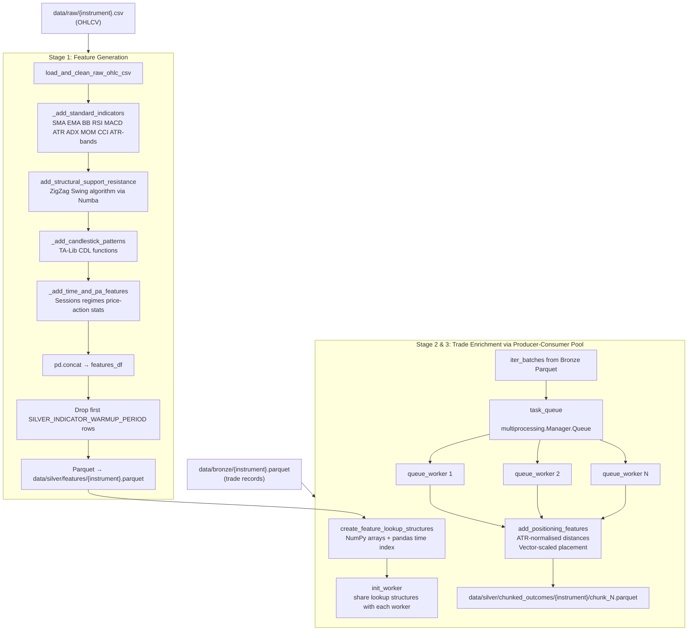
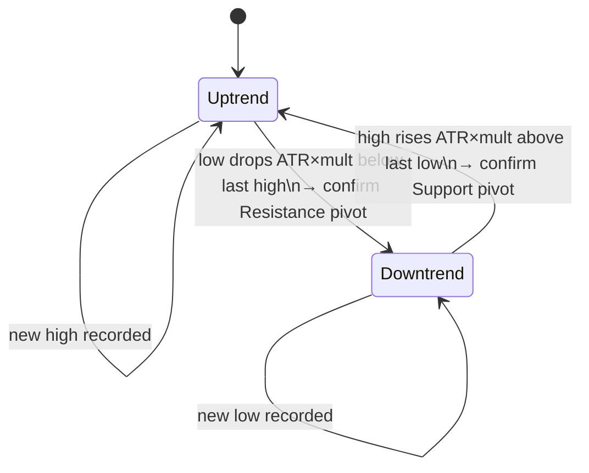

# Silver Layer Architecture

**File:** `docs/silver_architecture.md`  
**Source script:** `src/layers/silver/generator.py`

---

## Overview

The Silver Layer is the **Enrichment Engine**. It takes the raw trade records produced by the Bronze Layer and transforms them into an intelligent, context-rich dataset by answering the question: _"What was the market doing at the moment this trade was placed?"_

The layer has two concurrent responsibilities:

1. **Feature Generation** — Calculate a comprehensive set of technical indicators and market-context features for every candle in the raw OHLCV data. These are saved as the _Silver Features_ dataset.
2. **Trade Enrichment** — For each Bronze trade record, look up the market features at the trade entry candle and compute how the SL/TP prices relate to nearby market levels. This produces the _Chunked Outcomes_ dataset.

---

## Data Flow



---

## Inputs

| Source                             | Format  | Notes                                |
| ---------------------------------- | ------- | ------------------------------------ |
| `data/raw/{instrument}.csv`        | CSV     | OHLCV; needed for feature generation |
| `data/bronze/{instrument}.parquet` | Parquet | Trade records; needed for enrichment |

---

## Stage 1: Feature Generation

### Technical Indicators (`_add_standard_indicators`)

All periods are driven by lists in `config.py`, making the feature space fully configurable.

| Feature Group   | Columns Generated                                   | Config                             |
| --------------- | --------------------------------------------------- | ---------------------------------- |
| SMA             | `SMA_20`, `SMA_50`, `SMA_100`, `SMA_200`            | `SMA_PERIODS`                      |
| EMA             | `EMA_8`, `EMA_13`, `EMA_21`, `EMA_50`               | `EMA_PERIODS`                      |
| Bollinger Bands | `BB_upper_20`, `BB_lower_20`                        | `BBANDS_PERIODS`, `BBANDS_STD_DEV` |
| RSI             | `RSI_14`                                            | `RSI_PERIODS`                      |
| MACD histogram  | `MACD_hist_12_26_9`                                 | `MACD_FAST/SLOW/SIGNAL`            |
| ATR             | `ATR_14`                                            | `ATR_PERIODS`                      |
| ADX             | `ADX_14`                                            | `ADX_PERIODS`                      |
| ROC (Momentum)  | `MOM_10`                                            | `MOM_PERIODS`                      |
| CCI             | `CCI_20`                                            | `CCI_PERIODS`                      |
| ATR bands       | `ATR_level_up_1p0x_14`, `ATR_level_down_1p0x_14`, … | `ATR_BAND_MULTIPLIERS`             |

### Structural S/R — ZigZag Swing Points (`calculate_zigzag_levels_numba`)

A Numba-compiled ZigZag algorithm tracks the current trend direction. A trend reversal is confirmed when price moves `ATR × SWING_ATR_MULTIPLIER` away from the last confirmed swing high/low. The confirmed pivot price is forward-filled as a dynamic `resistance` or `support` level.



### Candlestick Pattern Recognition (`_add_candlestick_patterns`)

All TA-Lib pattern recognition functions (e.g. `CDL_DOJI`, `CDL_HAMMER`, `CDL_ENGULFING`, …) are called dynamically by iterating `talib.get_function_groups()["Pattern Recognition"]`. Each column returns an integer score (+100, 0, -100 etc.).

### Time & Price-Action Features (`_add_time_and_pa_features`)

| Feature                | Description                                                                                                                                                  |
| ---------------------- | ------------------------------------------------------------------------------------------------------------------------------------------------------------ |
| `session`              | Forex market session per candle (Tokyo / London / New York / Sydney / overlaps). Classified via `pd.cut` using `SESSION_BINS` / `SESSION_LABELS` from config |
| `hour`, `weekday`      | Raw UTC integer values                                                                                                                                       |
| `bullish_ratio_last_N` | Rolling mean of bullish candle indicator (N ∈ `PAST_LOOKBACKS`)                                                                                              |
| `avg_body_last_N`      | Rolling mean of candle body size                                                                                                                             |
| `avg_range_last_N`     | Rolling mean of candle high-low range                                                                                                                        |
| `trend_regime_14`      | `'trend'` if `ADX_14 > ADX_TREND_THRESHOLD` else `'range'`                                                                                                   |
| `vol_regime_14`        | `'high_vol'` if current ATR > rolling mean else `'low_vol'`                                                                                                  |

---

## Stage 2: Trade Enrichment

### Lookup Structure (`create_feature_lookup_structures`)

The features DataFrame is converted into efficient NumPy/pandas structures:

- **`feature_values_np`** — `(n_candles × n_level_cols)` float32 array; enables O(1) row access
- **`time_to_idx_lookup`** — `pd.Series` mapping `datetime → row index`
- **`atr_values_np`** — 1-D float32 array of ATR values for volatility normalisation

These structures are shared with worker processes via the `init_worker` initialiser, avoiding repeated serialisation.

### Positioning Features (`add_positioning_features`)

For each market level (SMA, EMA, BB band, ATR band, support, resistance) two types of relational feature pairs are computed for every trade:

**ATR-normalised distance:**

```
sl_dist_to_{level}_atr = (sl_price - level_price) / atr
tp_dist_to_{level}_atr = (tp_price - level_price) / atr
```

_Interpretation_: how many ATRs away is the SL/TP from this level? Ensures cross-year, cross-volatility-regime comparability.

**Linear vector scaling:**

```
denom = level_price - entry_price
sl_place_scale_{level} = (sl_price - entry_price) / denom
tp_place_scale_{level} = (tp_price - entry_price) / denom
```

_Interpretation_: 0 = at entry, 1.0 = exactly at the level, 1.5 = 50% past the level, -0.5 = on the opposite side.

### Producer-Consumer Architecture

```
Main thread → iter_batches(Bronze Parquet) → task_queue → N queue_workers
                                                          ↓
                                            add_positioning_features
                                                          ↓
                                    chunk_N.parquet saved to chunked_outcomes/
```

The `Manager().Queue` decouples I/O (reading Bronze Parquet) from CPU work (feature lookup + enrichment).

---

## Configuration Dependencies

| Config Key                         | Purpose                                                      |
| ---------------------------------- | ------------------------------------------------------------ |
| `SILVER_INDICATOR_WARMUP_PERIOD`   | Rows dropped from the start of features (default 200)        |
| `SILVER_PARQUET_BATCH_SIZE`        | Rows per Bronze Parquet batch passed to workers              |
| `SMA_PERIODS`, `EMA_PERIODS`, etc. | Indicator period lists                                       |
| `BBANDS_STD_DEV`                   | Bollinger Bands standard deviation multiplier                |
| `PIVOT_WINDOW`                     | (Defined; ZigZag uses ATR threshold instead of fixed window) |
| `SWING_ATR_MULTIPLIER`             | ATR multiplier for ZigZag reversal confirmation              |
| `SESSION_BINS`, `SESSION_LABELS`   | Forex session classification boundaries                      |
| `PAST_LOOKBACKS`                   | Rolling window sizes for price-action stats                  |
| `ADX_TREND_THRESHOLD`              | ADX cutoff for trend/range regime                            |
| `ATR_MA_WINDOW`                    | Rolling window for volatility regime average ATR             |
| `ATR_BAND_MULTIPLIERS`             | Dynamic ATR level multipliers                                |
| `MAX_CPU_USAGE`                    | Worker pool size                                             |

---

## Outputs

| Path                                                        | Format            | Contains                                                         |
| ----------------------------------------------------------- | ----------------- | ---------------------------------------------------------------- |
| `data/silver/features/{instrument}.parquet`                 | Parquet           | Per-candle market features; used by Gold and Strategy Discoverer |
| `data/silver/chunked_outcomes/{instrument}/chunk_N.parquet` | Parquet (N files) | Enriched trade records; used by Platinum layers                  |

### Chunked Outcomes Schema (representative columns)

| Column                                | Type           | Description                              |
| ------------------------------------- | -------------- | ---------------------------------------- |
| `entry_time`                          | datetime64[ns] | Trade entry candle                       |
| `trade_type`                          | category       | `buy` / `sell`                           |
| `entry_price`, `sl_price`, `tp_price` | float32        | Absolute prices                          |
| `sl_ratio`, `tp_ratio`                | float32        | Fractional SL/TP ratios                  |
| `outcome`                             | category       | `win` / `loss`                           |
| `sl_dist_to_{level}_atr`              | float32        | ATR-normalised SL distance to each level |
| `tp_dist_to_{level}_atr`              | float32        | ATR-normalised TP distance               |
| `sl_place_scale_{level}`              | float32        | Vector-scaled SL placement               |
| `tp_place_scale_{level}`              | float32        | Vector-scaled TP placement               |
